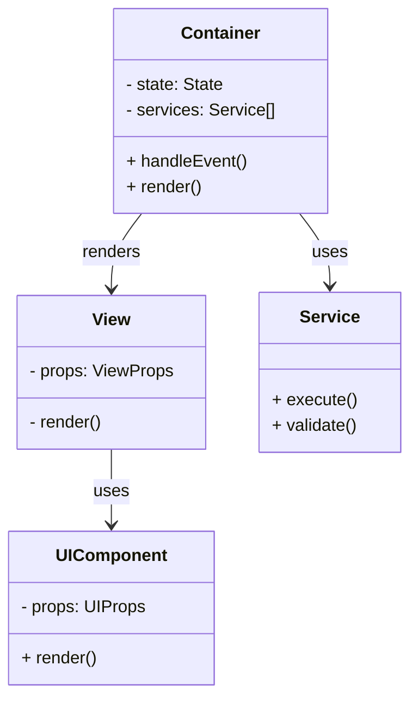
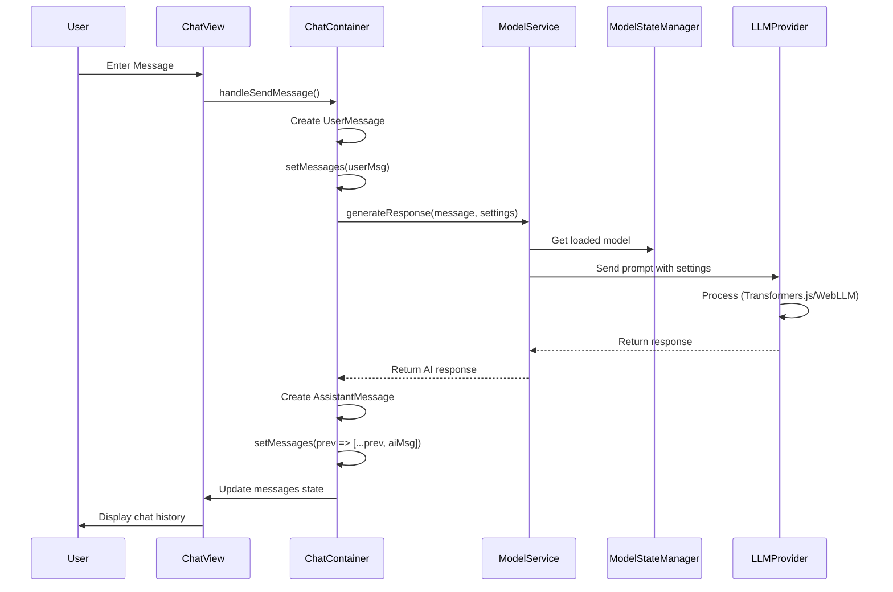
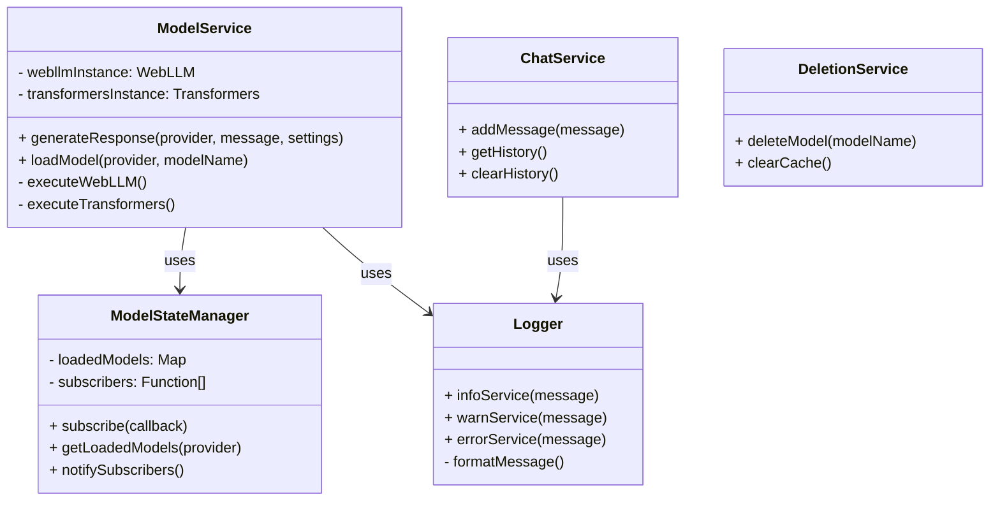
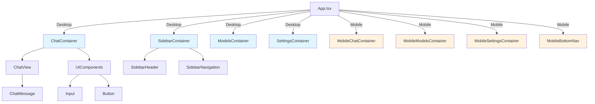

# TypeScript React Local LLM

**Language:** English
Plan:
- GemmaLocalUse.html zeigt wie wir Gemma Modelle etc. mit transformers mit einfachem javascript lokal laufen lasssen können
- Hosting mit GitHub Pages ist kostenlos und easy
---

## Overview

**TypeScript React Local LLM** is a modern web application that brings the power of Large Language Models directly to your browser, without requiring any server-side infrastructure. Built with React, TypeScript, and Vite, this application provides a seamless chat interface for local model execution using either the Transformers.js library or the WebLLM framework.

The application is designed with a clean, scalable architecture following the **Modular Facade Pattern** and **Container/View/UI layering**, ensuring maintainable and testable code. It supports both desktop and mobile platforms through Capacitor, with automatic pre-build validation and code quality checks.

**Key Features:**
- 🚀 Local LLM inference directly in the browser
- 🎯 Support for multiple LLM providers (Transformers.js, WebLLM)
- 📱 Responsive design for desktop and mobile devices
- ⚙️ Advanced chat settings (temperature, max tokens, presence penalty, mode)
- 🌐 Multi-language support (English, German)
- 🧪 Pre-build validation systems for code quality and architecture
- 📊 Real-time pipeline monitoring and logging
- 🎨 Clean, modular component architecture

---

## Architecture

### 1. Layer Overview

The application follows a **three-tier architecture pattern**:

```
┌─────────────────────────────────────────┐
│         Views (ChatView, etc.)          │
│   - Pure UI rendering logic             │
│   - No business logic                   │
│   - No useState/useEffect                │
└──────────────────┬──────────────────────┘
                   ↕
┌─────────────────────────────────────────┐
│    Containers (ChatContainer, etc.)     │
│   - State Management                    │
│   - Service Orchestration               │
│   - Event Handling                      │
└──────────────────┬──────────────────────┘
                   ↕
┌─────────────────────────────────────────┐
│    Services (ModelService, etc.)        │
│   - Business Logic                      │
│   - API/Provider Integration            │
│   - State Management (modelStateManager)│
└─────────────────────────────────────────┘
```

**Diagram 1: Component Architecture**



---

### 2. Chat Data Flow

**Diagram 2: Chat Message Flow**



---

### 3. Service Architecture (Modular Facade Pattern)

**Diagram 3: Service Facade Pattern**



---

### 4. App Structure (Desktop & Mobile)

**Diagram 4: Component Structure**



---

## Detailed Data Flow

### Processing User Message:

1. **View Layer**: User enters text and clicks send
2. **Container Layer**: `ChatContainer` receives event via props
3. **Container creates UserMessage**: With unique ID and timestamp
4. **Service Call**: `modelService.generateResponse()` is called with:
   - `provider`: 'webllm' or 'transformers'
   - `message`: User text
   - `settings`: ChatSettings (temperature, maxTokens, etc.)
5. **State Manager**: `modelStateManager` returns currently loaded model
6. **LLM Inference**: Corresponding provider executes inference
7. **Response Processing**: Response is received in `ChatContainer`
8. **UI Update**: State is updated, `ChatView` re-renders with new message

### Loading Model:

1. **ModelsContainer** displays available models
2. **User clicks "Load"** → Service is called
3. **modelService.loadModel()** with provider and modelName
4. **Provider loads model** (download from Hugging Face)
5. **modelStateManager.notifySubscribers()** updates all listeners
6. **ChatContainer** is notified → `isModelLoaded` = true
7. **UI enables chat input**

---

## Component Description

### Container Components
**Role:** State Management, Service Orchestration, Event Handling

- **ChatContainer**: Manages chat state, message history, provider switching
- **ModelsContainer**: Manages model list, loading/deletion, provider settings
- **SettingsContainer**: Manages global app settings
- **SidebarContainer**: Navigation and sidebar state
- **ContextExplorerContainer**: Context and file content management

### View Components
**Role:** Pure presentation, no logic, no state management

- **ChatView**: Displays message list and input field
- **ModelsView**: Displays model list and settings
- **SettingsView**: Displays settings options

### UI Components
**Role:** Reusable UI elements

- **Button, Input, Modal**: Base components
- **ChatMessage**: Individual message display
- **ChatSettingsPanel**: Settings widget for chat
- **Spinner**: Loading indicator
- **LivePipelineLog**: Log display

---

## Services

### 1. ModelService
```
Purpose: Central interface for LLM inference
Facade Methods:
  - generateResponse(provider, message, settings): Promise<string>
  - loadModel(provider, modelName): Promise<void>
  - listAvailableModels(provider): Promise<string[]>
Internal Logic:
  - WebLLM Integration (web-llm library)
  - Transformers.js Integration (@xenova/transformers)
  - Provider Abstraction
```

### 2. ModelStateManager
```
Purpose: Central state management for loaded models
Responsibilities:
  - Track which models are loaded
  - Subscriber pattern for state updates
  - Provider-specific state separation
Methods:
  - subscribe(callback: Function): () => void
  - getLoadedModels(provider: string): Set<string>
  - notifySubscribers(): void
```

### 3. Logger Service
```
Purpose: Structured logging system
Log Levels:
  - infoService(message): Info-level logs
  - warnService(message): Warning-level logs
  - errorService(message): Error-level logs
Features:
  - Feature flag-based control
  - LocalStorage persistence
  - Caller context detection
  - Export functionality
```

### 4. ChatService
```
Purpose: Chat history and message management
Methods:
  - addMessage(message: ChatMessage): void
  - getHistory(): ChatMessage[]
  - clearHistory(): void
  - exportHistory(): string
```

### 5. DeletionService
```
Purpose: Model and cache management
Methods:
  - deleteModel(provider, modelName): Promise<void>
  - clearCache(provider): Promise<void>
  - freeMemory(): Promise<void>
```

---

## Available Scripts

### Development and Build
```bash
# Start development server (with Pre-Build Checks)
npm run dev

# Full build with all Pre-Build Checks
npm run build

# Preview the build
npm run preview
```

### Code Quality
```bash
# Run ESLint checks
npm run lint

# Run Pre-Build Checks manually
node prebuild-check.js
```

---

## Pre-Build Check System

The Pre-Build Check System automatically runs **before every build or dev start** and performs several validations:

### 1. **Workflow Automation** (workflowAutomation.js)

**Purpose:** Test automation and dev-mode detection

**What is checked:**
- In **Build Mode**: `npm test -- --run` is executed
- In **Dev Mode**: Tests are skipped for faster development
- Environment variables: `NODE_ENV`, `SKIP_PREBUILD_TESTS`

**Behavior:**
```
Dev Mode (npm run dev):
  ⚠️ Tests are SKIPPED
  → Faster development workflow
  
Build Mode (npm run build):
  ✅ All tests EXECUTED
  → Full validation before production
```

**Configuration:**
```bash
# Skip tests (even in build mode)
SKIP_PREBUILD_TESTS=true npm run build

# Build in dev mode via environment variable
NODE_ENV=development npm run build
```

---

### 2. **View & UI Components Check** (viewUIComponentsChecker.js)

**Purpose:** Validation of the presentation layer

**File path conventions:**
- `src/views/` must contain files named `*View.tsx`, `*ViewProps.tsx`, or `.css`
- `src/ui/` must contain files named `*.tsx` or `.css`

**Logic validations:**
- ❌ No React Hooks in Views (useState, useEffect, useContext, useReducer, etc.)
- ❌ No inline styles (e.g., `style={{ color: 'red' }}`)
- ❌ No `<style>` tags → Always use external CSS files with className
- ❌ No imports from services or stateManagement

**Allowed:**
```typescript
// ✅ External CSS with className
import './ChatView.css';

export function ChatView({ messages, onSend }: ChatViewProps) {
  return (
    <div className="chat-view">
      {messages.map(msg => <ChatMessage key={msg.id} {...msg} />)}
    </div>
  );
}
```

**Not Allowed:**
```typescript
// ❌ useState in View
export function ChatView() {
  const [count, setCount] = useState(0); // VIOLATION!
}

// ❌ Inline Styles
<div style={{ color: 'red' }}> // VIOLATION!

// ❌ Style Tags
<style>{`.class { color: red; }`}</style> // VIOLATION!

// ❌ Service Imports
import { modelService } from '@services/model'; // VIOLATION!
```

---

### 3. **Container Components Check** (containerComponentsChecker.js)

**Purpose:** Validation of state management and orchestration layer

**File naming:**
- All container files must be named `*Container.tsx`
- Example: `ChatContainer.tsx`, `ModelsContainer.tsx`

**Import restrictions:**
- ⚠️ **NO imports from `ui/` components** → Direct DOM manipulation not allowed
  - BAD: `import Button from '@ui/Button';`
  - GOOD: Views use UI components, Containers use Views
  
- ✅ **Services as complete facades** → Don't access internal logic
  - BAD: `import { executeModel } from '@services/model/logic/execute.ts';`
  - GOOD: `import { modelService } from '@services/model';`

**HTML tag restrictions:**
- ❌ No direct `<input>` or `<button>` tags in containers
- → These belong in UI components or Views

**Structure example:**
```typescript
// ✅ Correct container structure
export function ChatContainer() {
  const [messages, setMessages] = useState([]);
  
  const handleSend = async (text: string) => {
    const response = await modelService.generateResponse(text);
    // ...
  };
  
  return <ChatView messages={messages} onSend={handleSend} />;
}

// ❌ Wrong: UI import from container
import Button from '@ui/Button';
export function BadContainer() {
  return <Button onClick={...}>Click</Button>; // VIOLATION!
}
```

---

### 4. **Service Components Check** (serviceComponentsChecker.js)

**Purpose:** Validation of the Modular Facade Pattern

**Facade requirements:**
- Each service must have an **index file** that exports all public functions
- Services are **black boxes** to other components

**Structure requirement:**
```
services/
└── model/
    <br /><br />├── index.ts          ← Main Facade (MUST HAVE ALL EXPORTS)
    <br /><br />├── IModelService.ts   ← Interface
    └── logic/            ← Internal implementation (NOT FOR IMPORTS)
        <br /><br />├── webllmLogic.ts
        └── transformersLogic.ts
```

**Validations:**
- ✅ Only `from '@services/model'` allowed
- ❌ NOT `from '@services/model/logic/...'`
- ❌ NOT `from '@services/model/webllmLogic'`

**Example:**
```typescript
// ✅ Correct
import { modelService } from '@services/model';

// ❌ Wrong - Internal logic access
import { webllmLogic } from '@services/model/logic/webllmLogic';
```

---

### 5. **Code Quality Check** (codeQualityChecker.js)

**Purpose:** Prevent best practices violations and anti-patterns

**What is checked:**

| Issue | Reason | Solution |
|-------|--------|----------|
| `console.log()` | Debug code shouldn't be in production | Use Logger Service |
| `console.error()` | Debug code shouldn't be in production | Use Logger Service |
| `console.warn()` | Debug code shouldn't be in production | Use Logger Service |
| `TODO/FIXME/HACK` | Incomplete code | Resolve before commit |
| Magic Numbers | Code readability | Define in constants |
| Hard-coded Strings | Maintainability | Define in config or constants |

**Examples:**

```typescript
// ❌ Violations
console.log('debug info'); // VIOLATION!
const timeout = 5000; // Magic number
if (count > 10) { } // Magic number

// ✅ Correct
import Logger from '@services/logger';
Logger.infoService('debug info');

const TIMEOUT_MS = 5000;
const MAX_RETRIES = 10;
if (count > MAX_RETRIES) { }
```

---

### Manual Execution

```bash
# Run all Pre-Build Checks
node prebuild-check.js

# Output example:
# 🔍 Running Pre-Build Checks...
# ✓ Running View & UI Components checks...
# ✓ Running Container Components checks...
# ✓ Running Service Components checks...
# ✓ Running Code Quality checks...
# ✅ All Pre-Build Checks passed!
```

---

### Error Handling

When a check fails:

```bash
$ npm run build

❌ Pre-Build Checks failed!
- src/views/ChatView.tsx: Contains useState (Line 10)
- src/services/model/testFile.ts: contains console.log (Line 25)

⚠️ Please fix the violations above before building.
```

**Steps to resolve:**
1. Read error messages
2. Open corresponding file
3. Fix violations (remove view logic, change console.log to Logger, etc.)
4. Run `npm run build` again

---

## File Structure

```
src/
<br /><br />├── components/           # Container Components
│   <br /><br />├── ChatContainer.tsx
│   <br /><br />├── ModelsContainer.tsx
│   <br /><br />├── SettingsContainer.tsx
│   <br /><br />├── mobileOnly/
│   └── ...
<br /><br />├── views/               # Pure View Components (no logic)
│   <br /><br />├── Chat/
│   │   └── ChatView.tsx
│   <br /><br />├── Settings/
│   └── ...
<br /><br />├── ui/                  # Reusable UI Components
│   <br /><br />├── Button.tsx
│   <br /><br />├── Input.tsx
│   <br /><br />├── ChatMessage.tsx
│   └── ...
<br /><br />├── services/            # Business Logic (Modular Facade Pattern)
│   <br /><br />├── model/
│   │   <br /><br />├── index.ts     (Public Facade)
│   │   <br /><br />├── IMhatService.ts
│   │   └── logic/
│   <br /><br />├── modelStateManager/
│   <br /><br />├── logger/
│   <br /><br />├── chat/
│   └── ...
<br /><br />├── config/              # Configuration & Feature Flags
<br /><br />├── i18n/                # Internationalization
<br /><br />├── hooks/               # Custom React Hooks
<br /><br />├── types.ts             # TypeScript Type Definitions
<br /><br />├── App.tsx              # Main App Component
└── main.tsx             # Entry Point

scripts/                 # Pre-Build & Automation Scripts
<br /><br />├── prebuild-check.js
<br /><br />├── workflowAutomation.js
<br /><br />├── viewUIComponentsChecker.js
<br /><br />├── containerComponentsChecker.js
<br /><br />├── serviceComponentsChecker.js
<br /><br />├── codeQualityChecker.js
└── checkUtils.js
```

---

## Installation & Setup

```bash
# Install dependencies
npm install

# Start dev server (with Pre-Build Checks)
npm run dev

# Production build (with all checks)
npm run build

# Preview build
npm run preview

# Run code quality checks
npm run lint
```

---

## Technology Stack

| Category | Technologies |
|----------|---------------|
| **Frontend Framework** | React 19.2 + TypeScript 5.9 |
| **Build Tool** | Vite 8 |
| **LLM Provider** | WebLLM 0.2.82, Transformers.js 2.17 |
| **Mobile** | Capacitor 8.3 |
| **Internationalization** | i18next 26, react-i18next 17 |
| **Code Quality** | ESLint 9.39, TypeScript |
| **UI Icons** | react-icons 5.6 |
| **Package Manager** | npm |

---

## Browser Support

- **Chrome/Edge**: Version 90+
- **Firefox**: Version 88+
- **Safari**: Version 14+
- **Mobile**: iOS Safari 14+, Chrome Android 90+

**WebAssembly (WASM) and WebWorkers are required** for LLM inference

---

## License

See `src/legal/usedLibs/licenses.json` for all used libraries.

---

## Additional Information

- Views, UI components, and containers are automatically validated by Pre-Build Checks
- Service Facade Pattern enables easy provider switching (WebLLM ↔ Transformers.js)
- Logger Service can be enabled/disabled via Feature Flags
- Mobile and desktop layouts are completely separated for optimal UX on each device

## Used NPM Libs
<br />├── @capacitor/android@8.3.0
<br />├── @capacitor/cli@8.3.0
<br />├── @capacitor/core@8.3.0
<br />├── @capacitor/device@8.0.2
<br />├── @capacitor/ios@8.3.0
<br />├── @capacitor/status-bar@8.0.2
<br />├── @capgo/capacitor-navigation-bar@8.0.25
<br />├── @emnapi/wasi-threads@1.2.1 extraneous
<br />├── @eslint/js@9.39.4
<br />├── @huggingface/transformers@3.8.1
<br />├── @mlc-ai/web-llm@0.2.82
<br />├── @types/node@24.12.2
<br />├── @types/react-dom@19.2.3
<br />├── @types/react@19.2.14
<br />├── @vitejs/plugin-react@6.0.1
<br />├── eslint-plugin-react-hooks@7.0.1
<br />├── eslint-plugin-react-refresh@0.5.2
<br />├── eslint@9.39.4
<br />├── globals@17.4.0
<br />├── i18next-browser-languagedetector@8.2.1
<br />├── i18next@26.0.3
<br />├── license-checker@25.0.1
<br />├── onnxruntime-web@1.24.3
<br />├── react-dom@19.2.4
<br />├── react-i18next@17.0.2
<br />├── react-icons@5.6.0
<br />├── react@19.2.4
<br />├── typescript-eslint@8.58.0
<br />├── typescript@5.9.3
<br />└── vite@8.0.3