# Local LLM – Browser-based AI Chat
Last Dependencies update: 04.2026
Last Edit: 04.2026 <br>
Language: TypeScript React with Vite + Capacitor<br>

Local LLM is a proof-of-concept application demonstrating how much is possible running large language models entirely inside the browser – no server, no API key, no data leaving the device. The app works on desktop and Android via a Capacitor wrapper. The core idea was to push the boundaries of what browsers can handle in terms of on-device AI inference, both on desktop and on smartphones.

Google Play Store: https://play.google.com/store/apps/details?id=de.scheub.localAI

**iOS / Apple App Store:** No public release was made for iOS. Apple's WebKit engine is significantly more restrictive than Chromium when it comes to WebAssembly memory limits and background worker threads. In practice, almost no model ran reliably in Safari – the app crashed repeatedly due to memory constraints imposed by the WebKit sandbox. This restriction is a fundamental platform limitation, not a code issue.

## Platform Compatibility

The following observations were made during development and testing:

| Platform | Status | Notes |
|---|---|---|
| Desktop (Chrome/Edge) | All models work | No memory issues, full WebGPU/WASM support |
| Android (Chrome) | Most models work | Larger models such as Gemma 4 did not load, likely due to device memory limits |
| iOS (Safari) | Almost no models work | WebKit severely limits WASM memory; app crashes consistently |

The most interesting finding: desktop browsers are surprisingly capable. Even larger quantized models ran without issues. On Android a good portion of models worked, but models above a certain size threshold (e.g. Gemma 4 variants) failed – most likely because the device RAM combined with WebKit's memory ceiling was too low. iOS was too restrictive to publish a viable app, so no App Store release was made.

## App Screenshots

| Chat | Models | Settings |
| ---- | ------ | -------- |
| 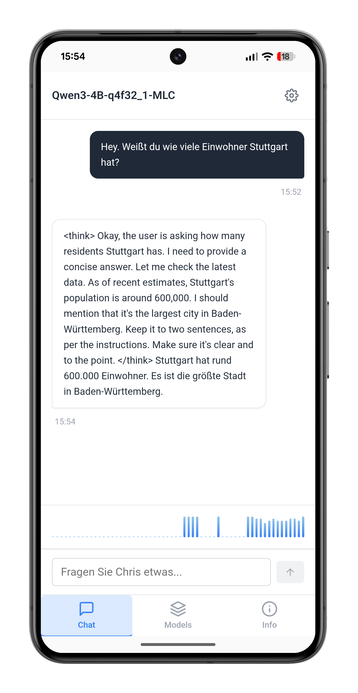 | 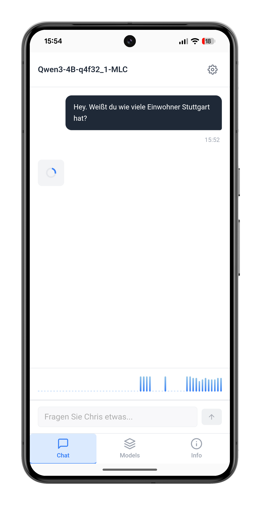 | 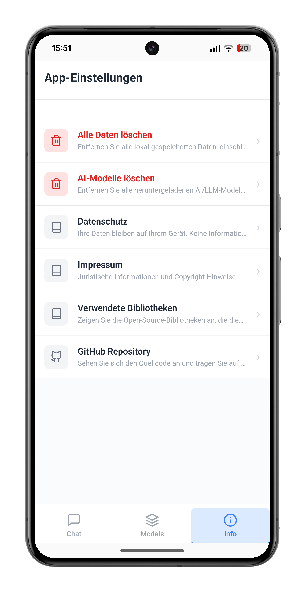 |

| Mobile Chat | Mobile Models | Mobile Settings |
| ----------- | ------------- | --------------- |
| 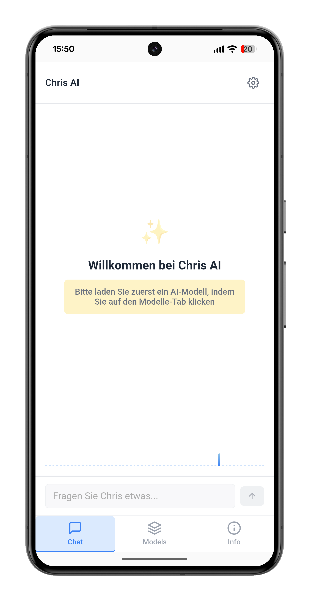 | 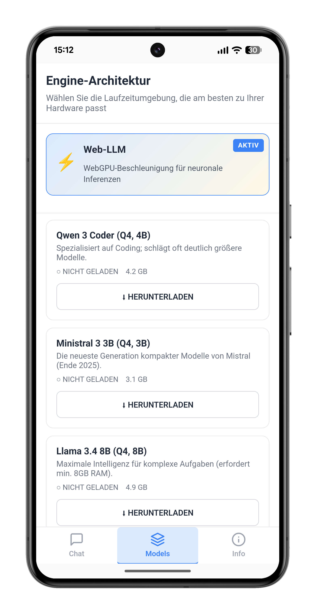 | 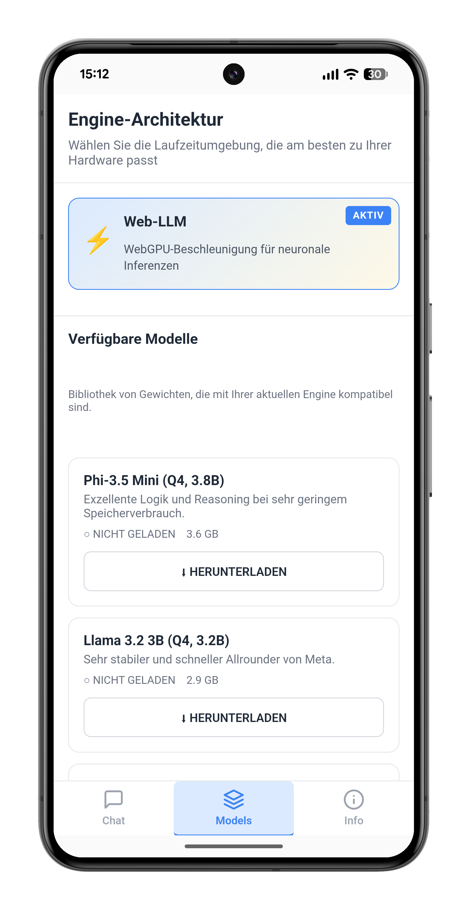 |

## Architecture

The components follow a strict four-layer architecture:

- `UI-Elements` – atomic, stateless building blocks (buttons, inputs, cards)
- `View-Components` – composed of UI elements, pure rendering, no logic or state
- `Container-Components` – state management, service orchestration, event handling
- `Service Layer` – business logic, LLM provider integration, logging, state management

### 1. Layer Overview

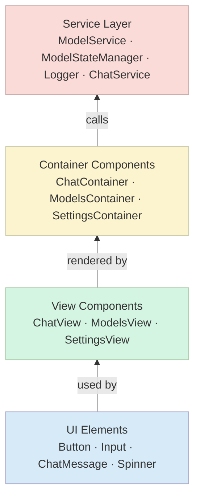

### 2. Chat Message Data Flow

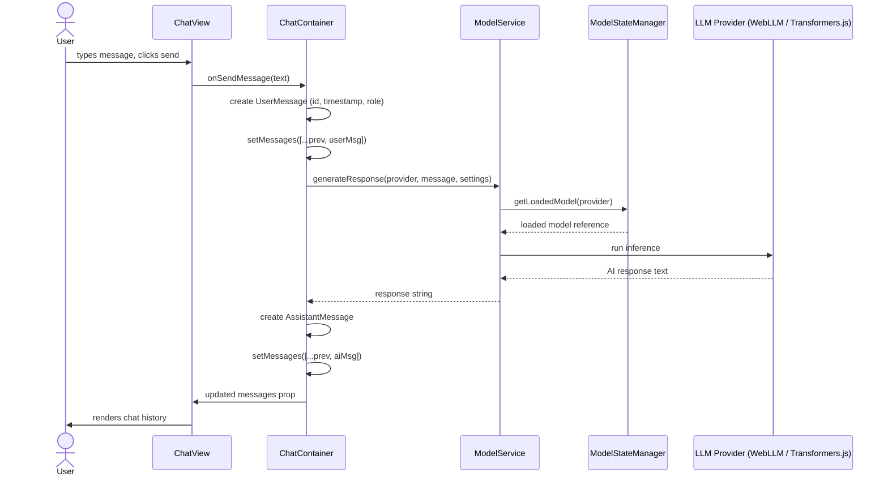

### 3. Model Loading Flow

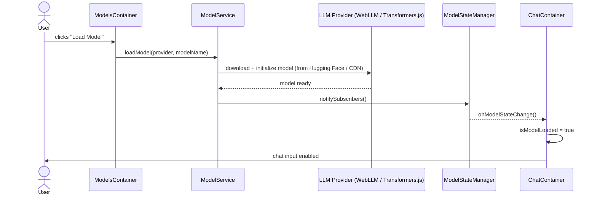

### 4. Service Facade Architecture

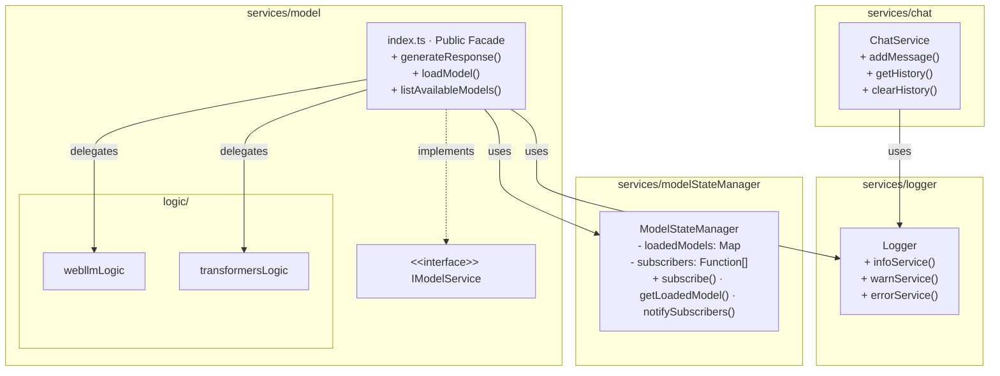

> Only `index.ts` (the facade) may be imported from outside the service package. Direct imports of `logic/` files are forbidden and caught by the pre-build checker.

### 5. Desktop vs Mobile Component Tree

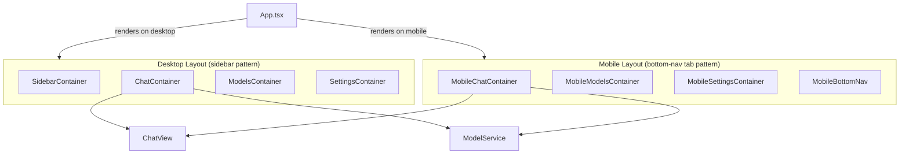

## Pre-Build Check System

Before every build and dev-server start, a suite of static analysis scripts enforces architectural rules. All checkers are in `scripts/` and are run by `prebuild-check.js`.

| Checker | File | What it enforces |
|---|---|---|
| Service Components Checker | `scripts/serviceComponentsChecker.js` | Modular Facade pattern: each service must expose only its `index.ts`; no imports from `logic/` subfolders outside the service |
| Code Quality Checker | `scripts/codeQualityChecker.js` | No `console.log/warn/error`; no magic numbers; no inline styles |
| Container Components Checker | `scripts/containerComponentsChecker.js` | Containers must not import UI components directly; no raw `input`/`button` HTML tags |
| View & UI Components Checker | `scripts/viewUIComponentsChecker.js` | Views must not use `useState`/`useEffect`; no service imports; no inline styles |

The build fails with a detailed violation list if any rule is broken.

## Available Scripts

### `npm run dev`
Starts the development server (with pre-build checks, tests skipped for speed).
Open [http://localhost:5173](http://localhost:5173) to view it in the browser.

### `npm run build`
Full production build including all pre-build checks and test run.

### `npm run lint`
Runs ESLint across the entire source tree.

### `npx license-checker --json --production --out licenses.json`
Generates a JSON file with all NPM package licenses. Replaces the existing file under `src/legal/usedLibs/`.

## File Structure

```
src/
├── components/           # Container Components
│   ├── ChatContainer.tsx
│   ├── ModelsContainer.tsx
│   ├── SettingsContainer.tsx
│   ├── mobileOnly/
│   └── ...
├── views/               # Pure View Components (no logic, no state)
│   ├── Chat/
│   │   └── ChatView.tsx
│   ├── Settings/
│   └── ...
├── ui/                  # Reusable UI Elements
│   ├── Button.tsx
│   ├── Input.tsx
│   ├── ChatMessage.tsx
│   └── ...
├── services/            # Business Logic (Modular Facade Pattern)
│   ├── model/
│   │   ├── index.ts     (Public Facade)
│   │   ├── IModelService.ts
│   │   └── logic/
│   ├── modelStateManager/
│   ├── logger/
│   ├── chat/
│   └── ...
├── config/              # Configuration & Feature Flags
├── i18n/                # Internationalization (EN, DE)
├── hooks/               # Custom React Hooks
├── types.ts             # TypeScript Type Definitions
├── App.tsx              # Main App Component
└── main.tsx             # Entry Point

scripts/
├── prebuild-check.js
├── workflowAutomation.js
├── viewUIComponentsChecker.js
├── containerComponentsChecker.js
├── serviceComponentsChecker.js
├── codeQualityChecker.js
└── checkUtils.js
```

## Technology Stack

| Category | Technology |
|---|---|
| Frontend Framework | React 19.2 + TypeScript 5.9 |
| Build Tool | Vite 8 |
| LLM Provider (in-browser) | WebLLM 0.2.82, Transformers.js (@huggingface/transformers 3.8) |
| Mobile Wrapper | Capacitor 8.3 |
| Internationalization | i18next 26, react-i18next 17 |
| Code Quality | ESLint 9.39 |
| UI Icons | react-icons 5.6 |

## Browser Support

WebAssembly (WASM) and Web Workers are required for LLM inference to work.

| Browser | Support |
|---|---|
| Chrome / Edge 90+ | Full support, best performance |
| Firefox 88+ | Supported |
| Safari 14+ (desktop) | Partial; memory limits apply |
| Chrome Android 90+ | Most models work |
| Safari iOS | Not viable; WebKit memory caps cause consistent crashes |

## Used NPM Modules

<br /> ├── @capacitor/android@8.3.0
<br /> ├── @capacitor/cli@8.3.0
<br /> ├── @capacitor/core@8.3.0
<br /> ├── @capacitor/device@8.0.2
<br /> ├── @capacitor/ios@8.3.0
<br /> ├── @capacitor/status-bar@8.0.2
<br /> ├── @capgo/capacitor-navigation-bar@8.0.25
<br /> ├── @eslint/js@9.39.4
<br /> ├── @huggingface/transformers@3.8.1
<br /> ├── @mlc-ai/web-llm@0.2.82
<br /> ├── @types/node@24.12.2
<br /> ├── @types/react-dom@19.2.3
<br /> ├── @types/react@19.2.14
<br /> ├── @vitejs/plugin-react@6.0.1
<br /> ├── eslint-plugin-react-hooks@7.0.1
<br /> ├── eslint-plugin-react-refresh@0.5.2
<br /> ├── eslint@9.39.4
<br /> ├── globals@17.4.0
<br /> ├── i18next-browser-languagedetector@8.2.1
<br /> ├── i18next@26.0.3
<br /> ├── license-checker@25.0.1
<br /> ├── react-dom@19.2.4
<br /> ├── react-i18next@17.0.2
<br /> ├── react-icons@5.6.0
<br /> ├── react@19.2.4
<br /> ├── typescript-eslint@8.58.0
<br /> ├── typescript@5.9.3
<br /> └── vite@8.0.3

## License

See `src/legal/usedLibs/licenses.json` for all third-party library licenses.
